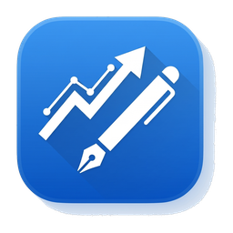

<div align="center">



# TradeLog

**A native macOS trading journal that just gets out of your way.**

Daily PnL, monthly calendar, equity curve, goal tracking — local-first, signed
auto-updates, no cloud.

[](#install)
[](https://tauri.app)
[](https://react.dev)
[](https://github.com/JaehanCho/tradelog/releases/latest)
[](https://github.com/JaehanCho/tradelog/releases)
[](LICENSE)

[Install](#install) · [Features](#features) · [Shortcuts](#keyboard-shortcuts) · [Develop](#develop) · [Roadmap](#roadmap)

</div>

---

## Why

Spreadsheets eat your willpower. Notion is for product managers. Excel
hijacks your fonts. You want one app that opens in 0.3 seconds, takes a
deposit, an end balance, and a one-line note — and never asks you to log in.

That's TradeLog.

## Features

- **🍎 macOS-native** — Real Tauri 2 binary, vibrancy sidebar, system colors,
  proper dark mode. No Electron tax.
- **📂 Multi-sector journal** — Sidebar tabs for **Trading**, **DeFi**, and
  **Tips**. Total assets sum across sectors and live in the always-on hero
  card.
- **🗓️ Recent journal feed** — A compact card grid above the trading grid
  that surfaces only the days where a trade or market note exists, newest
  first. Click a card to jump into the day detail drawer.
- **📅 PnL calendar** — Binance-style heatmap. Green days, red days, see
  your month at a glance.
- **📈 Equity curve** — Recharts-powered area chart with a goal reference
  line. Watch the line go up.
- **🎯 Goal tracking** — Set a target balance and date; the hero shows
  progress as a sleek progress bar.
- **🗒️ Day drawer** — Click ▶ on any row to open a side drawer with the
  day's stats, the per-trade note, and a separate **market note** for
  free-form thoughts on what the market did that day.
- **🌾 DeFi positions** — Track yield-farming / staking positions with
  protocol, principal, and periodic snapshots. Approximate APR is computed
  from the latest snapshot vs. principal.
- **💡 Tips archive** — Save trading tips, quotes, and personal insights as
  cards with tags, source, and pin support. Masonry layout, instant search,
  ⌘N for new, ⌘F to focus search.
- **⌨️ Keyboard-first** — Click a cell, ⌘C/⌘V to copy and paste. ⌘⇧C/⌘⇧V
  copies and clones an entire row to the next free date. ⌘Z undoes anything.
- **🔢 Auto-compute** — Start balance carries from yesterday's end balance
  + today's deposit − yesterday's withdrawal. Never re-type a number.
- **🔄 Signed auto-update** — minisign-verified updates straight from
  GitHub Releases. No update servers, no telemetry.
- **🔒 Local-first** — All data lives in
  `~/Library/Application Support/com.tradelog.app/db.sqlite`. You own it.
  Back it up, sync it via iCloud, do whatever.
- **🌐 Bilingual** — Switch between **KO / EN** from the sidebar at any time.
  Choice is persisted in the local DB and survives restarts.

## Install

Grab the latest `.dmg` from the [Releases page](https://github.com/JaehanCho/tradelog/releases/latest)
and drag `TradeLog.app` to `/Applications`.

> [!NOTE]
> The build is **ad-hoc signed** (no Apple Developer ID yet), so first launch
> may show a Gatekeeper warning. Right-click → Open the first time, then
> macOS will remember it.

After the first launch, every subsequent release auto-updates — you'll see a
toast in the bottom-right when a new version is ready. Click "지금 설치", and
the app relaunches into the new version.

## Keyboard shortcuts

| Shortcut | What it does |
|---|---|
| **Click a cell** | Select |
| **Double-click** | Edit |
| **Click a row's ▶** | Open the day detail drawer |
| **⌘C** / **⌘V** | Copy/paste a single cell value |
| **⌘⇧C** / **⌘⇧V** | Copy a row / paste it into the next free date |
| **⌘Z** / **⌘⇧Z** | Undo / redo (50 steps) |
| **Esc** (in drawer) | Close the drawer |
| **⌘Enter** (in drawer textarea) | Save and keep editing |
| **⌘N** (Tips view) | New tip |
| **⌘F** (Tips view) | Focus the search box |
| **Click a row's ✕** | Delete that day |
| **Click a calendar month** | Filter the grid to that month |

## Quick tour

```
┌──────────────┬──────────────────────────────────────────┐
│  Sidebar     │  Hero: total assets (Trading + DeFi)    │
│ ▸ Trading    │  + sector breakdown bar                  │
│   ㄴ All     ├──────────────────────────────────────────┤
│   ㄴ 2026-05 │  Trading view:                            │
│   ㄴ 2026-04 │   Equity curve · monthly stats · cal.    │
│   DeFi       │   Recent journal feed (notes only)       │
│   Tips       │   Trading grid                            │
│ ─ Footer ─── │  DeFi view:                               │
│ KO/EN  vX.Y  │   Position cards + snapshot timeline     │
│              │  Tips view:                               │
│              │   Masonry cards · tags · search · ⌘N     │
└──────────────┴──────────────────────────────────────────┘
```

## Develop

```sh
git clone https://github.com/JaehanCho/tradelog.git
cd tradelog
pnpm install
pnpm tauri dev   # spawns the desktop window
# or
pnpm dev         # frontend-only, opens at http://localhost:1420
```

> [!TIP]
> The browser-only mode (`pnpm dev`) is great for verifying CSS/layout — but
> Tauri IPC commands won't resolve, so the grid will be empty. Use it for
> visual checks, not data flows.

### Test & lint

```sh
pnpm test          # vitest, pure compute logic
pnpm exec tsc -b   # TypeScript type-check across the workspace
```

### Bundle a release locally

```sh
pnpm tauri build   # produces .app + .dmg under src-tauri/target/...
```

## Architecture

```
┌─────────────────────────────┐    invoke()    ┌──────────────────┐
│  React 18 + Vite + Zustand  │ ─────────────▶ │  Rust (Tauri 2)  │
│  react-data-grid · Recharts │ ◀───────────── │  rusqlite        │
└─────────────────────────────┘   serde JSON   └─────────┬────────┘
                                                         │
                                                ┌────────▼────────┐
                                                │  SQLite (WAL)   │
                                                │  trading_day,   │
                                                │  app_setting,   │
                                                │  defi_position, │
                                                │  defi_snapshot, │
                                                │  wisdom_note    │
                                                └─────────────────┘
```

- **Frontend** computes derived fields (`start_balance`, `daily_pnl`,
  `cumulative_return_pct`) in pure functions (`src/lib/compute.ts`) — no
  round-trips, no perf surprises.
- **Backend** owns persistence: `rusqlite` with WAL mode and an atomic
  `rename_or_upsert` for date PK changes (no silent merges).
- **State**: Zustand store with a 50-step undo history; every mutation pushes
  a snapshot, undo replays it via `replace_all_trading_days`.

## Languages

TradeLog ships with **Korean** and **English**. Toggle from the sidebar
footer (segmented `KO | EN` control). Adding a third locale takes about ten
minutes — see `src/i18n/messages.ts`. The bundle's TypeScript shape is
inferred from the type declaration; missing keys fail compilation, so a new
locale can't drift out of sync silently.

## Tech stack

- **Shell:** Tauri 2 (Rust) — macOS-only, with `macos-private-api` for
  vibrancy
- **Frontend:** React 18, TypeScript, Vite
- **Storage:** SQLite via `rusqlite` (bundled), `rusqlite_migration`
- **Grid:** `react-data-grid@7.0.0-beta.47` with custom cell editors
- **Chart:** `recharts` (AreaChart + ReferenceLine)
- **State:** `zustand`
- **Updates:** `tauri-plugin-updater` (minisign signature verification)
- **Clipboard:** `tauri-plugin-clipboard-manager` (bypasses macOS paste prompt)

## Roadmap

- [x] DeFi / yield-farming sector with periodic snapshots
- [x] Tips archive (quotes, tips, personal insights with tags)
- [x] Day detail drawer with separate market-note field
- [x] Recent journal feed for at-a-glance review of recent notes
- [ ] CSV / Excel export from the sidebar
- [ ] Drawdown / max-equity overlay on the curve
- [ ] Manual dark-mode toggle (system preference + override)
- [ ] ⌘K command palette
- [ ] Per-day strategy tags + tag-level analytics
- [ ] Mood / discipline rating (1–5) with correlation against returns
- [ ] Note search + date-range filter
- [ ] Skip weekends / holidays in `+ next day`
- [ ] Per-trade entry mode (ticker, side, PnL)
- [ ] DeFi: optional price-API auto-sync for snapshots
- [ ] Image attachments (clipboard paste) in notes & wisdom
- [ ] Optional cloud sync (Cloudflare D1 / Supabase)

See [`tasks/todo.md`](tasks/todo.md) for the full backlog and recent
findings.

## Releasing

The release pipeline lives in [`.github/workflows/release.yml`](.github/workflows/release.yml).
Pushing a `vX.Y.Z` tag triggers a universal-darwin build, signs it with
minisign, and drops a draft release with `.dmg`, `.tar.gz`, `.tar.gz.sig`,
and `latest.json`. Promote with:

```sh
gh release edit vX.Y.Z --draft=false --latest
```

## Contributing

This is a personal tool, but issues and PRs are welcome — especially around
trading-specific UX. Bring receipts: a clear repro for bugs, or a sketch of
the UX for features.

## License

[MIT](LICENSE) © Jaehan Cho

<div align="center">

—

*Track your trades. Beat yesterday.*

</div>
